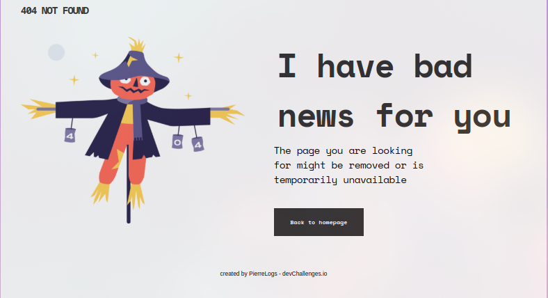

<!-- Please update value in the {}  -->

<h1 align="center">404 Page Not Found Challenge</h1>

   Solution for a challenge from  <a href="http://devchallenges.io" target="_blank">Devchallenges.io</a>.

  <h3>
    <a href="https://pierre-ol.github.io/404-NotFound/">
      Demo
    </a>
     | 
    <a href="https://github.com/Pierre-OL/404-NotFound">
      Solution
    </a>
     | 
    <a href="https://devchallenges.io/challenges/wBunSb7FPrIepJZAg0sY">
      Challenge
    </a>
  </h3>

<!-- TABLE OF CONTENTS -->

## Table of Contents

- [Overview](#overview)
  - [Built With](#built-with)
- [Features](#features)
- [Contact](#contact)
- [Acknowledgements](#acknowledgements)

<!-- OVERVIEW -->

## Overview

<!--Introduce your projects by taking a screenshot or a gif. Try to tell visitors a story about your project by answering:

- Where can I see your demo?
- What was your experience?
- What have you learned/improved?
- Your wisdom? :)-->

See my project on [Github/404-NotFound](https://github.com/Pierre-OL/404-NotFound)
As a practitioner I managed to learn more about css in units, variables, responsive design and upload my demo to the web

**Additional tip:**

- Use github pages to upload my demo
- It is better to use the BEM method
- Deployed by Github

### Built With

<!-- This section should list any major frameworks that you built your project using. Here are a few examples.-->

This project does not include frames as it was built only with:

- [HTML](https://developer.mozilla.org/es/docs/Web/HTML)
- [CSS](https://developer.mozilla.org/en-US/docs/Web/CSS)

## Features

<!-- List the features of your application or follow the template. Don't share the figma file here :) -->

This application/site was created as a submission to a [DevChallenges](https://devchallenges.io/challenges) challenge. The [challenge](https://devchallenges.io/challenges/wBunSb7FPrIepJZAg0sY) was to build an application to complete the given user stories.

## Acknowledgements

<!-- This section should list any articles or add-ons/plugins that helps you to complete the project. This is optional but it will help you in the future. For exmpale -->

- [Steps to replicate a design with only HTML and CSS](https://devchallenges-blogs.web.app/how-to-replicate-design/)
<!-- [Node.js](https://nodejs.org/)-->
- [Marked - a markdown parser](https://github.com/chjj/marked)

## Contact

- Website [404-NotFound](https://pierre-ol.github.io/404-NotFound/)
- GitHub [Pierre-OL](https://github.com/Pierre-OL)
- Twitter [lepierre19](https://twitter.com/lepierre19)
